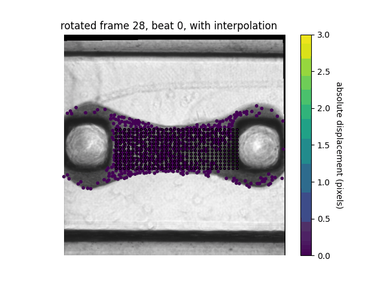
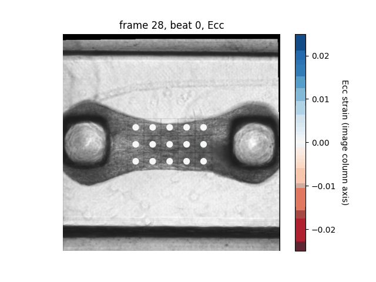
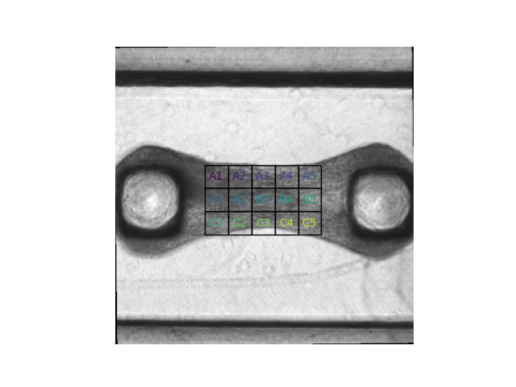
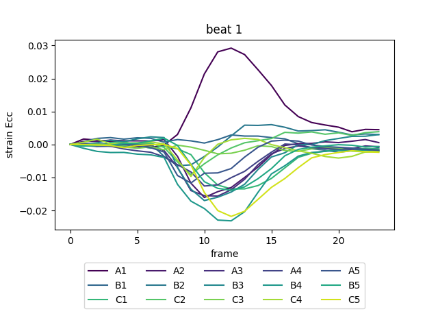

# Microbundle Compute Repository Lite

[](https://www.python.org/)

[](https://github.com/sandialabs/sibl#license)

[](https://github.com/elejeune11/microbundlecompute-lite/actions) [](https://codecov.io/gh/elejeune11/microbundlecompute-lite)

## Table of Contents
* [Project Summary](#summary)
* [Project Roadmap](#roadmap)
* [Installation Instructions](#install)
* [Tutorial](#tutorial)
* [Validation](#validation)
* [To-Do List](#todo)
* [References to Related Work](#references)
* [Contact Information](#contact)
* [Acknowledgements](#acknowledge)

## Project Summary <a name="summary"></a>

The MicroBundleCompute repository is a private repository under development that will be released under an open source license once additional validation is complete. The MicroBundleCompute-Lite repository contains a limited set of features that have been released early to share with collaborators on a shorter timescale.

## Project Roadmap <a name="roadmap"></a>

The goal of this work is to create a multi-purpose tools for analyzing heterogeneous cardiac microtissue deformation and strain from movies of beating microtissue. At present, we have a preliminary version of the code working, and we are in the process of making it fully automated and fully validated. If you have example data that you would like to include in this endeavor please get in touch.

<p align = "center">


</p>

## Installation Instructions <a name="install"></a>

### Get a copy of the microbundle compute repository on your local machine

The best way to do this is to create a GitHub account and ``clone`` the repository. However, you can also download the repository by clicking the green ``Code`` button and selecting ``Download ZIP``. Download and unzip the ``microbundlecompute-lite-main`` folder and place it in a convenient location on your computer.


### Create and activate a conda virtual environment

1. Install [Anaconda](https://docs.anaconda.com/anaconda/install/) on your local machine.
2. Open a ``Terminal`` session (or equivalent) -- note that Mac computers come with ``Terminal`` pre-installed (type ``⌘-space`` and then search for ``Terminal``).
3. Type in the terminal to create a virtual environment with conda:
```bash
conda create --name microbundle-compute-lite-env python=3.9.13
```
4. Type in the terminal to activate your virtual environment:
```bash
conda activate microbundle-compute-lite-env
```
5. Check to make sure that the correct version of python is running (should be ``3.9.13``)
```bash
python --version
```
6. Update some base modules (just in case)
```bash
pip install --upgrade pip setuptools wheel
```

Note that once you have created this virtual environment you can ``activate`` and ``deactivate`` it in the future -- it is not necessary to create a new virtual environment each time you want to run this code, you can simply type ``conda activate microbundle-compute-lite-env`` and then pick up where you left off (see also: [conda cheat sheet](https://docs.conda.io/projects/conda/en/4.6.0/_downloads/52a95608c49671267e40c689e0bc00ca/conda-cheatsheet.pdf)).


### Install microbundle compute

1. Use a ``Terminal`` session to navigate to the ``microbundlecompute-lite-main`` folder (i.e., change your working directory). The command ``cd`` will allow you to do this (see: [terminal cheat sheet](https://terminalcheatsheet.com/))
2. Type the command ``ls`` and make sure that the file ``pyproject.toml`` is in the current directory.
3. Now, create an editable install of microbundle compute:
```bash
pip install -e .
```
4. If you would like to see what packages this has installed, you can type ``pip list``
5. You can test that the code is working with pytest (all tests should pass):
```bash
pytest -v --cov=microbundlecomputelite  --cov-report term-missing
```
6. To run the code from the terminal, simply start python (type ``python``) and then type ``from microbundlecomputelite import image_analysis as ia``. For example:
```bash
(microbundle-compute-env) eml-macbook-pro:microbundlecompute-lite-main emma$ python
Python 3.9.13 | packaged by conda-forge | (main, May 27 2022, 17:01:00) 
[Clang 13.0.1 ] on darwin
Type "help", "copyright", "credits" or "license" for more information.
>>> from microbundlecomputelite import image_analysis as ia
>>> ia.hello_microbundle_compute()
>>> "Hello World!
```

## Tutorial <a name="tutorial"></a>

This GitHub repository contains a folder called ``tutorials`` that contains an example dataset and python script for running the code. To run the tutorials, change your curent working directory to the ``tutorials`` folder.

### Preparing data for analysis <a name="data_prep"></a>

The data will be contained in the ``movie`` folder. Critically:
1. The files must have a ``.TIF`` extension.
2. The files can have any name, but in order for the code to work properly they must be *in order*. For reference, we use ``sort`` to order file names:
```bash
(wound-compute-env) eml-macbook-pro:tutorials emma$ python
Python 3.9.13 | packaged by conda-forge | (main, May 27 2022, 17:01:00) 
[Clang 13.0.1 ] on darwin
Type "help", "copyright", "credits" or "license" for more information.
>>> bad_example = ["1","2","3","4","5","6","7","8","9","10","11","12","13","14","15"]
>>> bad_example.sort()
>>> print(bad_example)
['1', '10', '11', '12', '13', '14', '15', '2', '3', '4', '5', '6', '7', '8', '9']
>>>
>>> good_example = ["01","02","03","04","05","06","07","08","09","10","11","12","13","14","15"]
>>> good_example.sort()
>>> print(good_example)
['01', '02', '03', '04', '05', '06', '07', '08', '09', '10', '11', '12', '13', '14', '15']
>>> another_good_example = ["test_001","test_002","test_003","test_004","test_005","test_006","test_007","test_008","test_009","test_010","test_011","test_012","test_013","test_014","test_015"]
>>> another_good_example.sort()
>>> print(another_good_example)
['test_001', 'test_002', 'test_003', 'test_004', 'test_005', 'test_006', 'test_007', 'test_008', 'test_009', 'test_010', 'test_011', 'test_012', 'test_013', 'test_014', 'test_015']
```
3. If it is necessary to read other file types or formats (e.g., a single 3D TIFF array), that would be easy to implement -- single images are implemented now so that we don't exceed maximum file sizes allowable on GitHub.

The mask will be contained in the ``masks`` folder. Critically:
1. The current version of the code can use an externally generated mask titled ``tissue_mask.txt``.
2. Alternatively, the user can generate a mask using the ``create_tissue_mask`` functions. Additional instructions for this are given below.
3. Future functionality for new mask generation functions is possible.
4. In our examples, ``tissue_mask.png`` is simply a visualization of this mask.


Here is how the folders will be structured:
```bash
|___ example_folder
|        |___ movie
|                |___"*.TIF"
|        |___ masks    (this folder can be omitted if automated mask generation will be run as a first step)
|                |___"tissue_mask.txt"
|                |___"tissue_mask.png"      (optional)
```

### Current core functionality

In the tutorial provided, there are 5 core functionalities available. As a brief note, it is: (1) not necessary to use all functionality (e.g., you can consider displacement but ignore strain or skip the visualization steps), (2) additional functionality is currently under development, and (3) for the code snippets in this section the variable ``folder_path`` is a [``PosixPath``](https://docs.python.org/3/library/pathlib.html) that specifies the relative path between where the code is being run and the ``example_folder`` defined [above](#data_prep).

#### Automatic mask generation

The function ``run_create_tissue_mask`` will use a specified segmentation function (e.g., ``seg_fcn_num = 1`` ) and movie frame number (e.g., ``frame_num = 0``) to create a tissue mask text file with the name specified by the variable ``fname``. The subsequent steps of the code will require a file called ``tissue_mask.txt`` that should either be created with this function or manually. At present, there are two segmentation function types available: (1) a straightforward threshold based mask, and (2) a threshold based mask that is applied after a Sobel filter.

```bash
from microbundlecomputelite import create_tissue_mask as ctm
from pathlib import Path

input_folder = Path(folder_path)
seg_fcn_num = 1
fname = "tissue_mask"
frame_num = 0
ctm.run_create_tissue_mask(input_folder, seg_fcn_num, fname, frame_num)
```

#### Fiducial marker identification, tracking, and visualization

The function ``run_tracking`` will automatically read the data specified by the input folder (tiff files and mask file), run tracking, segment individual beats in time, and save the results.

```bash
import matplotlib.pyplot as plt
from microbundlecomputelite import image_analysis as ia
from pathlib import Path

input_folder = Path(folder_path)
ia.run_tracking(input_folder)

col_max = 3
col_map = plt.cm.viridis
ia.run_visualization(input_folder, col_max, col_map)
```

The function ``run_visualization`` is for visualizing the tracking results. The input ``col_max`` is the maximum displacement in pixels and the input ``col_map`` is the [matplotlib colormap](https://matplotlib.org/stable/tutorials/colors/colormaps.html) selected for visualization.

#### Post-tracking rotation

It's possible that the images may not be aligned with the desired global coordinate system. After tracking, it's possible to rotate the images and tracking results based on a specified center of rotation and desired horizontal axis vector. Note that rotation must be run after tracking. This was an intentional ordering as rotating the images involves interpolation which will potential lead to loss of information. To automatically rotate based on the mask, run the code with the following inputs:
```bash
input_mask = True
ia.run_rotation(input_folder, input_mask)
```
To rotate based on specified center, set ``input_mask = False`` and provide additional command line arguments. For example:
```bash
input_mask = False
center_row_input = 100
center_col_input = 100
vec_input = np.asarray([1, 0])

ia.run_rotation(input_folder, input_mask, center_row_input=center_row_input, center_col_input=center_col_input, vec_input=vec_input)
```

<p align = "center">

&nbsp
&nbsp

</p>


Note: there is also a function ``run_scale_and_center_coordinates()`` to transform the tracking results (rescale and center). If needed, this should be used as a final step.

#### Post-tracking interpolation and visualization

The tracking results are returned at the automatically identified fiducial marker points. However, it may be useful to know displacements at other locations (e.g., on a grid). After tracking and rotation, we can interpolate the displacement field to specified sampling points:

```bash
row_vec = np.linspace(215, 305, 12)
col_vec = np.linspace(120, 400, 30)
row_grid, col_grid = np.meshgrid(row_vec, col_vec)
row_sample = row_grid.reshape((-1, 1))
col_sample = col_grid.reshape((-1, 1))
row_col_sample = np.hstack((row_sample, col_sample))
fname = "interpolated_rotated"
ia.run_interpolate(input_folder, row_col_sample, fname, is_rotated=True)
```

<p align = "center">

</p>


#### Post-tracking strain computation and visualization

After tracking (but without the need for any prior rotation or interpolation) we can compute sub-domain strains. The way the function is implemented currently, the microtissue will be automatically rotated before strain sub-domain analysis to match the global row vs. column coordinate system. To do this, we use the shape of the mask to automatically define an array of sub-domains.

The average strain within each sub-domain will then be computed from the tracking results. Altering the inputs to the strain computation function will change the way the sub-domains are initialized.

```bash
from microbundlecomputelite import strain_analysis as sa

pillar_clip_fraction = 0.5
shrink_row = 0.1
shrink_col = 0.1
tile_dim_pix = 40
num_tile_row = 5
num_tile_col = 3
tile_style = 1
sa.run_sub_domain_strain_analysis(input_folder, pillar_clip_fraction, shrink_row, shrink_col, tile_dim_pix, num_tile_row, num_tile_col, tile_style)

col_min = -0.025
col_max = 0.025
col_map = plt.cm.RdBu
sa.visualize_sub_domain_strain(input_folder, col_min, col_max, col_map)
```
For ``tile_style = 1``, the algorithm will fit the maximum number of tiles with the specified side length ``tile_dim_pix``. For ``tile_style = 2``, the algorithm will use the specified grid size (``num_tile_row``, ``num_tile_col``) and adjust the side length.

<p align = "center">


</p>

<p align = "center">

</p>

At present, strain visualizations show the column-column entry of the Green-Lagrange strain tensor ($E_{cc}$ where $c$ is the global horizontal coordinate axis defined by the image column). The deformation gradient of each sub-domain is saved so visualizing alternative strain quantities is straightforward.

### Running the code

Once the code is [installed](#install) and the data is set up according to the [instructions](#data_prep), running the code is actually quite straightforward. To run the tutorial examples, navigate in the Terminal so that your current working directory is in the ``tutorials`` folder. To run the code on the provided single example, type:
```bash
python run_code_tutorial.py files/example_data
```
And it will automatically run the example specified by the ``files/example_data`` folder and the associated visualization function. You can use the ``run_code_tutorial.py`` to run your own code, you just need to specify a relative path between your current working directory (i.e., the directory that your ``Terminal`` is in) and the data that you want to analyze. Alternatively, you can modify ``run_code_tutorial.py`` to make running code more conveneint (i.e., remove command line arguments, skip some steps). Here is how the outputs of the code will be structured (in the same folder as inputs ``movie`` and ``masks``):
```bash
|___ example_data
|        |___ movie
|                |___"*.TIF"
|        |___ masks
|                |___"tissue_mask.txt"
|                |___"tissue_mask.png"      (optional)
|        |___ results
|                |___"info.txt"
|                |___"beat%i_row.txt"
|                |___"beat%i_col.txt"
|                |___"rot_info.txt"
|                |___"rotated_beat%i_row.txt"
|                |___"rotated_beat%i_col.txt"
|                |___"interpolated_rotated_beat%i_row.txt"
|                |___"interpolated_rotated_beat%i_col.txt"
|                |___"strain__sub_domain_info.txt"
|                |___"strain__beat%i_row.txt"
|                |___"strain__beat%i_col.txt"
|                |___"strain__beat%i_Fcc.txt"
|                |___"strain__beat%i_Fcr.txt"
|                |___"strain__beat%i_Frc.txt"
|                |___"strain__beat%i_Frr.txt"
|        |___ visualizations
|                |___pngs
|                   |___"%04_disp.png"
|                   |___"%rotated_04_disp_with_interp.png"
|                |___"abs_disp.gif"
|                |___"rotated_abs_disp_with_interp.gif"
|                |___strain_pngs
|                   |___"%04_strain.png"
|                   |___"strain_sub_domain_key.png"
|                   |___"strain_timeseries_Ecc_beat%i.png"
|                |___"sub_domain_strain.gif"
```

### Understanding the output files

The outputs of running this code will be stored in the ``results`` folder. The first file, ``info.txt`` has three columns. Column 0 refers to the ``beat_number`` (e.g., beat 0 is the first beat, beat 1 is the second beat etc.). Column 1 refers to the ``first_frame`` of each beat. Column 2 refers to the ``last_frame`` of each beat. These will be the frame numbers in the original movie 0 indexed. For example, ``info.txt`` could contain:
```bash
0 3 25
1 25 49
2 49 72
```
and mean that beat 0 starts at frame 3 and ends at frame 25, beat 1 starts at frame 25 and ends at frame 49, and beat 2 starts at frame 49 and ends at frame 72. Note that if full beats cannot be segmented from the timeseries data there may be issues with running the code. Often, the visually apparent first and last beat will be excluded from this segmentation because we cannot identify clear start and end points.

Then, there will be one row-position file and one col-position file for each beat. The ``row`` and ``col`` positions match the original image provided. Specifically:
* ``beat%i_row_pos.txt`` will contain the image row positions of each marker for the beat specified by ``%i``
* ``beat%i_col_pos.txt`` will contain the image column positions of each marker for the beat specified by ``%i``
In these text files, the rows correspond to individual markers, while the columns correspond to the frames of the beat. For example, if a file has dimension ``AA x BB``, there will be ``AA`` markers and ``BB`` frames.

The file ``rot_info.txt`` will contain information to reconstruct the rotation if needed. The first row contains the row center position and the column center position. The second row contains the rotation unit vector with the row in the first position and the column in the second position. For example, ``rot_info.txt`` could contain:
```bash
266.5   255
0       1
```
The rotated row and column positions are then stored in ``rotated_beat%i_row_pos.txt`` and ``rotated_beat%i_col_pos.txt``. The interpolated row and column positions (starting from the sample points in frame 0 of each beat) are stored in ``interpolated_rotated_beat%i_row_pos.txt`` and ``interpolated_rotated_beat%i_col_pos.txt``.

The file ``strain__sub_domain_info.txt`` will contain information about the strain subdomains. The first row contains the number of row sub divisions and the number of column sub divisions. The second row contains the number of pixels in the sub-domain sides. The third row contains the row center position and the column center position. The fourth row contains the rotation unit vector with the row in the first position and the column in the second position. For example, ``strain__sub_domain_info.txt`` could contain:
```bash
3       5
40      40
266.5   255
0       1
```
which would correspond to a 3x5 array of sub-domains with a 40 pixel side length.

### Understanding the visualization results

The outputs of running the visualization code will be stored in the ``visualizations`` folder.

For the displacement tracking results, we plot absolute displacement of the identified markers. There is an optional argument in the visualization script that can be used to set the displacement bounds and the colormap. The default is absolute displacement ranging from 0-10 pixels, and the default colormap is [``viridis``](https://matplotlib.org/stable/tutorials/colors/colormaps.html). 

<p align = "center">


</p>

For the strain tracking results, we plot $E_{cc}$ for each sub-domain. Specifically, we visualize $E_{cc}$ organized in space in ``sub_domain_strain.gif`` and ``%04d_strain.png``, and we visualize $E_{cc}$ in time (i.e., vs. frame number) in ``strain_timeseries_Ecc_beat%i.png``. The legend in the timeseries plots corresponds to the sub-domain labels in ``strain_sub_domain_key.png``.

In all cases, the output visualizations are stored as ``.pngs`` and as a ``.gif`` -- ``.mp4`` functionality was removed due to issues with ffmpeg on some machines.

## Validation <a name="validation"></a>

Additional validation studies beyond basic testing are still underway and will be included with the full repository release.

## To-Do List <a name="todo"></a>

- [x] Share preliminary version of the code with collaborators
- [ ] Update code according to collaborators needs -- please get in touch with requests or questions -- for example, would you like us to add functions to re-sample the locations of the displacement?, are there cases in your dataset where it is not possible to segment full beats?
- [x] Adjust code so that the dictionaries for timeseries segmentation are computed automatically
- [x] Adjust code so that the dictionaries for feature and tracking parameters can be conveniently adjusted
- [ ] Continue validation and working on the full repository
- [x] Add testing and tutorials for strain functionality


## References to Related Work <a name="references"></a>

Related work can be found here:
* Das, S. L., Sutherland, B. P., Lejeune, E., Eyckmans, J., & Chen, C. S. (2022). Mechanical response of cardiac microtissues to acute localized injury. American Journal of Physiology-Heart and Circulatory Physiology, 323(4), H738-H748.

Related repositories include:
* https://github.com/elejeune11/Das-manuscript-2022
* https://github.com/elejeune11/MicroBundleCompute (currently private)

## Contact Information <a name="contact"></a>

For additional information, please contact Emma Lejeune ``elejeune@bu.edu`` or Hiba Kobeissi ``hibakob@bu.edu``.

## Acknowledgements <a name="acknowledge"></a>

Thank you to Shoshana Das for providing the example tissue included with this repository. And -- thank you to Chad Hovey for providing templates for I/O, testing, and installation via the [Sandia Injury Biomechanics Laboratory](https://github.com/sandialabs/sibl) repository.
