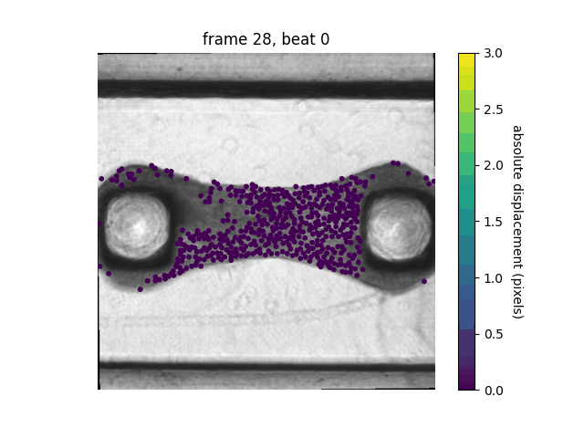

# Microbundle Compute Repository Lite

[](https://www.python.org/)

[](https://github.com/sandialabs/sibl#license)

[](https://github.com/elejeune11/microbundlecompute-lite/actions) [](https://codecov.io/gh/elejeune11/microbundlecompute-lite)

## Table of Contents
* [Project Summary](#summary)
* [Project Roadmap](#roadmap)
* [Installation Instructions](#install)
* [Tutorial](#tutorial)
* [Validation](#validation)
* [To-Do List](#todo)
* [References to Related Work](#references)
* [Contact Information](#contact)
* [Acknowledgements](#acknowledge)

## Project Summary <a name="summary"></a>

The MicroBundleCompute repository is a private repository under development that will be released under an open source license once additional validation is complete. The MicroBundleCompute-Lite repository contains a limited set of features that have been released early to share with collaborators on a shorter timescale.

## Project Roadmap <a name="roadmap"></a>

The goal of this work is to create a multi-purpose tools for analyzing heterogeneous cardiac microtissue deformation and strain from movies of beating microtissue. At present, we have a preliminary version of the code working, and we are in the process of making it fully automated and fully validated. If you have example data that you would like to include in this endeavor please get in touch.

<p align = "center">

</p>

## Installation Instructions <a name="install"></a>

### Get a copy of the microbundle compute repository on your local machine

The best way to do this is to create a GitHub account and ``clone`` the repository. However, you can also download the repository by clicking the green ``Code`` button and selecting ``Download ZIP``. Downloaded and unzip the ``microbundlecompute-lite-main`` folder and place it in a convenient location on your computer.


### Create and activate a conda virtual environment

1. Install [Anaconda](https://docs.anaconda.com/anaconda/install/) on your local machine.
2. Open a ``Terminal`` session (or equivalent) -- note that Mac computers come with ``Terminal`` pre-installed (type ``⌘-space`` and then search for ``Terminal``).
3. Type in the terminal to create a virtual environment with conda:
```bash
conda create --name microbundle-compute-lite-env python=3.9.13
```
4. Type in the terminal to activate your virtual environment:
```bash
conda activate microbundle-compute-lite-env
```
5. Check to make sure that the correct version of python is running (should be ``3.9.13``)
```bash
python --version
```
6. Update some base modules (just in case)
```bash
pip install --upgrade pip setuptools wheel
```

Note that once you have created this virtual environment you can ``activate`` and ``deactivate`` it in the future -- it is not necessary to create a new virtual environment each time you want to run this code, you can simply type ``conda activate microbundle-compute-lite-env`` and then pick up where you left off (see also: [conda cheat sheet](https://docs.conda.io/projects/conda/en/4.6.0/_downloads/52a95608c49671267e40c689e0bc00ca/conda-cheatsheet.pdf)).


### Install microbundle compute

1. Use a ``Terminal`` session to navigate to the ``microbundlecompute-lite-main`` folder. The command ``cd`` will allow you to do this (see: [terminal cheat sheet](https://terminalcheatsheet.com/))
2. Type the command ``ls`` and make sure that the file ``pyproject.toml`` is in the current directory.
3. Now, create an editable install of microbundle compute:
```bash
pip install -e .
```
4. If you would like to see what packages this has installed, you can type ``pip list``
5. You can test that the code is working with pytest (all tests should pass):
```bash
pytest -v --cov=microbundlecompute-lite  --cov-report term-missing
```
6. To run the code from the terminal, simply start python (type ``python``) and then type ``from microbundlecompute-lite import image_analysis as ia``. For example:
```bash
(microbundle-compute-env) eml-macbook-pro:microbundlecompute-lite-main emma$ python
Python 3.9.13 | packaged by conda-forge | (main, May 27 2022, 17:01:00) 
[Clang 13.0.1 ] on darwin
Type "help", "copyright", "credits" or "license" for more information.
>>> from microbundlecompute-lite import image_analysis as ia
>>> ia.hello_microbundle_compute()
>>> "Hello World!
```

## Tutorial <a name="tutorial"></a>

This GitHub repository contains a folder called ``tutorials`` that contains an example dataset and python script for running the code.

### Preparing data for analysis <a name="data_prep"></a>

The data will be contained in the ``movie`` folder. Critically:
1. The files must have a ``.TIF`` extension.
2. The files can have any name, but in order for the code to work properly they must be *in order*. For reference, we use ``sort`` to order file names:
```bash
(wound-compute-env) eml-macbook-pro:tutorials emma$ python
Python 3.9.13 | packaged by conda-forge | (main, May 27 2022, 17:01:00) 
[Clang 13.0.1 ] on darwin
Type "help", "copyright", "credits" or "license" for more information.
>>> bad_example = ["1","2","3","4","5","6","7","8","9","10","11","12","13","14","15"]
>>> bad_example.sort()
>>> print(bad_example)
['1', '10', '11', '12', '13', '14', '15', '2', '3', '4', '5', '6', '7', '8', '9']
>>>
>>> good_example = ["01","02","03","04","05","06","07","08","09","10","11","12","13","14","15"]
>>> good_example.sort()
>>> print(good_example)
['01', '02', '03', '04', '05', '06', '07', '08', '09', '10', '11', '12', '13', '14', '15']
>>> another_good_example = ["test_001","test_002","test_003","test_004","test_005","test_006","test_007","test_008","test_009","test_010","test_011","test_012","test_013","test_014","test_015"]
>>> another_good_example.sort()
>>> print(another_good_example)
['test_001', 'test_002', 'test_003', 'test_004', 'test_005', 'test_006', 'test_007', 'test_008', 'test_009', 'test_010', 'test_011', 'test_012', 'test_013', 'test_014', 'test_015']
```
3. If it is necessary to read other file types or formats (e.g., a single 3D TIFF array), that would be easy to implement -- single images are implemented now so that we don't exceed maximum file sizes allowable on GitHub.

The mask will be contained in the ``masks`` folder. Critically:
1. The current version of the code uses an externally generated mask titled ``tissue_mask.txt``.
2. In our examples, ``tissue_mask.png`` is simply a visualization of this mask.
3. Future functionality will involve code for automatically generated masks.

Here is how the folders will be structured:
```bash
|___ Example_folder
|        |___ movie
|                |___"*.TIF"
|        |___ masks
|                |___"tissue_mask.txt"
|                |___"tissue_mask.png"      (optional)
```

(Note: more sophisticated I/O is currently under development, and will include input files etc.)

### Running the code

Once all of the previous steps are completed, running the code is actually quite straightforward. To run the tutorial examples, navigate in the terminal so that your current directory is in the ``tutorials`` folder. To run the code on the provided single example, type:
```bash
python run_code_tutorial.py files/example_data
```
And it will automatically run the example specified by the ``files/example_data`` folder and the associated visualization function. You can use the ``run_code_tutorial.py`` to run your own code, you just need to specify a relative path between your current working directory (i.e., the directory that your ``Terminal`` is in) and the data that you want to analyze. Alternatively, you can modify ``run_code_tutorial.py`` to make running code more conveneint (i.e., remove command line arguments, skip the visualization step).

### Understanding the output files

The outputs of running this code will be stored in the ``results`` folder. The first file, ``info.txt`` has three columns. Column 0 refers to the ``beat_number`` (e.g., beat 0 is the first beat, beat 1 is the second beat etc.). Column 1 refers to the ``first_frame`` of each beat. Column 2 refers to the ``last_frame`` of each beat. These will be the frame numbers in the original movie 0 indexed. For example, ``info.txt`` could contain:
```bash
0 3 25
1 25 49
2 49 72
```
and mean that beat 0 starts at frame 3 and ends at frame 25, beat 1 starts at frame 25 and ends at frame 49, and beat 2 starts at frame 49 and ends at frame 72. Note that if full beats cannot be segmented from the timeseries data there may be issues with running the code. Often, the visually apparent first and last beat will be excluded from this segmentation because we cannot identify clear start and end points.

Then, there will be one row-position file and one col-position file for each beat. The ``row`` and ``col`` positions match the original image provided. Specifically:
* ``beat%i_row_pos.txt`` will contain the row positions of each marker for the beat specified by ``%i``
* ``beat%i_col_pos.txt`` will contain the column positions of each marker for the beat specified by ``%i``
In these text files, the rows correspond to individual markers, while the columns correspond to the frames of the beat. For example, if a file has dimension ``AA x BB``, there will be ``AA`` markers and ``BB`` frames.

### Understanding the visualization results

The outputs of running the visualization code will be stored in the ``visualizations`` folder. Here, we plot absolute displacement of the identified markers. There is an optional argument in the visualization script that can be used to set the displacement bounds and the colormap. The default is absolute displacement ranging from 0-10 pixels, and the default colormap is ``cividis`` (see https://matplotlib.org/stable/tutorials/colors/colormaps.html for options). The output visualizations are stored as ``.pngs``, ``.gif`` and ``.mp4``.

<p align = "center">

</p>

In this particular example, note that tracking points are not automatically identified in blurry regions of the tissue. If desired, we can: (1) lower quality parameters to pick up more tracking points in these areas, (2) create functions for interpolation, or (3) leave as is to avoid added uncertainty and motivate higher resolution microscopy images.

## Validation <a name="validation"></a>

Additional validation studies beyond basic testing are still underway and will be included with the full repository release.

## To-Do List <a name="todo"></a>

- [x] Share preliminary version of the code with collaborators
- [ ] Update code according to collaborators needs -- please get in touch with requests or questions -- for example, would you like us to add functions to re-sample the locations of the displacement?, are there cases in your dataset where it is not possible to segment full beats?
- [ ] Continue validation and working on the full repository
- [ ] In particular, add testing and tutorials for strain functionality


## References to Related Work <a name="references"></a>

Related work can be found here:
* Das, S. L., Sutherland, B. P., Lejeune, E., Eyckmans, J., & Chen, C. S. (2022). Mechanical response of cardiac microtissues to acute localized injury. American Journal of Physiology-Heart and Circulatory Physiology, 323(4), H738-H748.

Related repositories include:
* https://github.com/elejeune11/Das-manuscript-2022
* https://github.com/elejeune11/MicroBundleCompute (currently private)

## Contact Information <a name="contact"></a>

For additional information, please contact Emma Lejeune ``elejeune@bu.edu`` or Hiba Kobeissi ``hibakob@bu.edu``.

## Acknowledgements <a name="acknowledge"></a>

Thank you to Shoshana Das for providing the example tissue included with this repository. And -- thank you to Chad Hovey for providing templates for I/O, testing, and installation via the [Sandia Injury Biomechanics Laboratory](https://github.com/sandialabs/sibl) repository.
